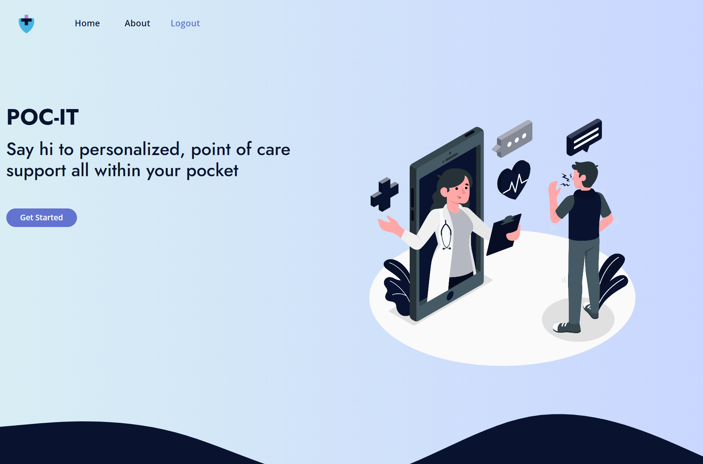
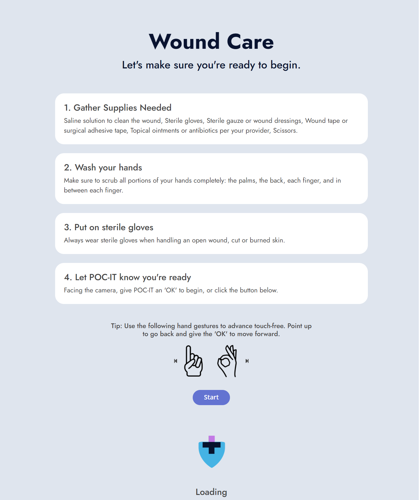

# POC-IT 

###

Deployed Application: https://poc-it.herokuapp.com/

 

## Description

- POC-IT (Point of Care Information Technology) is our solution to both the risks of self wound treatment and the stress placed on the healthcare industry due to infections and complications caused by improper home care. We provide an application that allows users to get detailed instructions and information on their healthcare needs from their computer or mobile device, making use of machine learning to provide hand gesture control to allow users to maintain a clean environment while performing procedures.

## Table of Contents

[Installation](#installation)

[Usage](#usage)

[License](#license)

[Contributing](#contributing)

[Known Bugs](#known-bugs)

[Future Development](#future-development)

[Questions](#questions)

## Installation

- ### How to install POC-IT

  - POC-IT is designed to be a mobile-first progressive web application that will function on desktops, tablets, and phones without any installation.

## Usage

- First time users will be asked to create an account as either a patient or provider. Upon creation, users may login to their account from the home screen. Once a user has succesfully logged in they will be presented with a list of their active procedures if they are a patient or a list of their patients if they are a provider. Selecting a procedure will display the user with a list of preperation steps as well as instructions for navigating through the procedure with hand gestures. When ready, click start or give the camera an 'OK' gesture to begin your procedure in a clean hands-free environment.

## License

Copyright 2020 Team POC-IT

    Permission to use, copy, modify, and/or distribute this software for any purpose with or without fee is hereby granted, provided that the above copyright notice and this permission notice appear in all copies.

    THE SOFTWARE IS PROVIDED "AS IS" AND THE AUTHOR DISCLAIMS ALL WARRANTIES WITH REGARD TO THIS SOFTWARE INCLUDING ALL IMPLIED WARRANTIES OF MERCHANTABILITY AND FITNESS. IN NO EVENT SHALL THE AUTHOR BE LIABLE FOR ANY SPECIAL, DIRECT, INDIRECT, OR CONSEQUENTIAL DAMAGES OR ANY DAMAGES WHATSOEVER RESULTING FROM LOSS OF USE, DATA OR PROFITS, WHETHER IN AN ACTION OF CONTRACT, NEGLIGENCE OR OTHER TORTIOUS ACTION, ARISING OUT OF OR IN CONNECTION WITH THE USE OR PERFORMANCE OF THIS SOFTWARE.

## Contributing

- ### Contributing to POC-IT

  - POC-IT is currently in a development phase that is no longer accepting additional contributions, but check back later to see how you can help the team!

## Known Bugs

- The machine learning process is an ongoing endeavor that is always providing new challenges. Currently the accuracy of the gesture recognition suffers in low lighting environments and we are still working to optimize its performance.

## Future Development

- Their are several features in active development including patient/procedure assignment, on-the-fly photo's and storage as well as communication tools for providers and patients.

## Questions

- If you would like to contact us with further questions you can reach any of us at

  - Hoang Nguyen

    - hd.nguyen11@gmail.com
    - https://github.com/hngdngng

  - Jacob Ashworth

    - jeashwor@gmail.com
    - https://github.com/jeashwor

  - Jacob Lovins

    - lovins.jacob@yahoo.com
    - https://github.com/jacoblovins

  - TJ Fitzpatrick

    - tjfitz@comcast.net
    - https://github.com/TJFitz

  - Let's collaborate!
